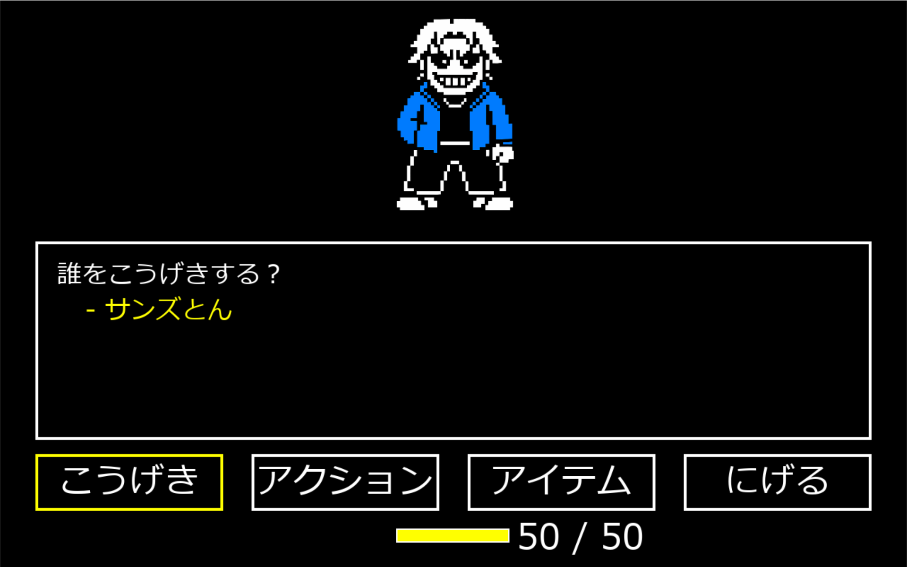

# KOKATAIL

## 実行環境の必要条件
*python >= 3.10
*pygame >= 2.1

## ゲームの概要
*主人公のソウルを操作して敵の攻撃をよけながら敵を倒す、もしくは逃げる、コマンドゲーム

## ゲームの遊び方
*矢印キーでソウルを操作し，自分のターンに敵を倒す
*ダメージを受けてHPが0になったら死亡する

## ゲームの実装
### 共通基本機能
*背景画像と主人公キャラクターの描画

### 分担追加機能
*こうげき機能の追加(C0A24264)
*アクション機能の追加（はなす）（分析）（だまる）（C0A24080）
*アイテム機能の追加（C0A24068）
*逃げる機能の追加（C0A24020）
*敵の行動の追加（会話）（攻撃）（ソウルの操作）（C0A24008）

### 敵の行動
*プレイヤーのターン終了後敵のターン（攻撃）が始まる

## 操作方法
*矢印キー：コマンド、ソウルの移動操作
*Enterキー：コマンドの決定、コメント等の次へ進める
*Qキー：コマンド選択に戻る
*altキー+F4キー：ゲームの強制終了（プレイヤーのターンに限る）
